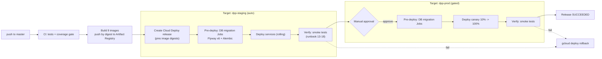
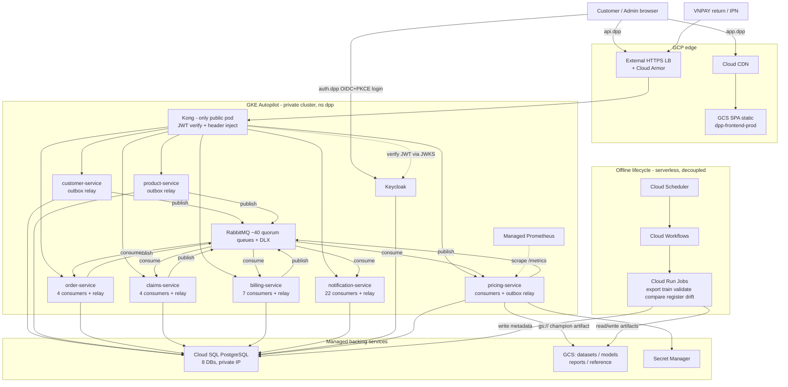
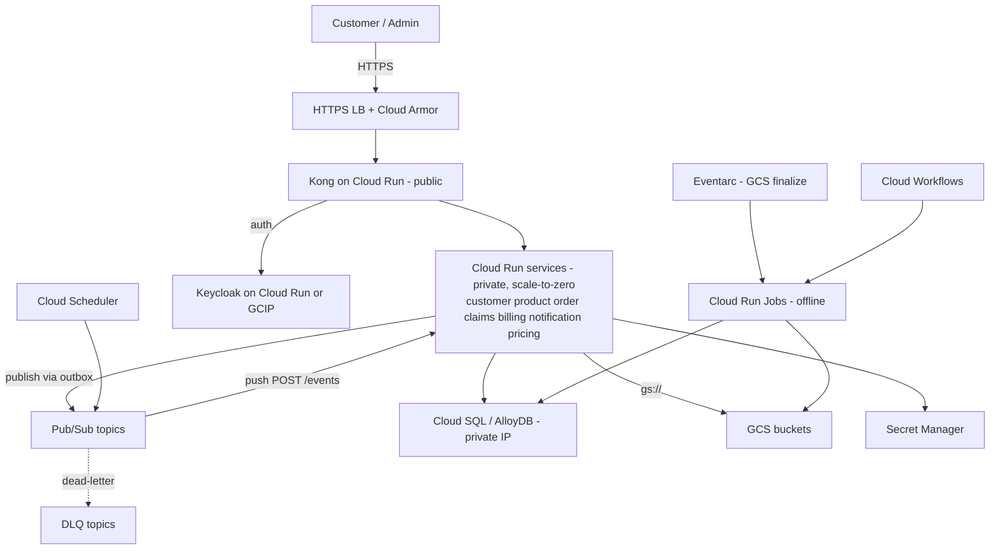

# Dynamic Pricing Platform — Google Cloud Deployment Design

> Scope: deploy the **entire platform** (all 7 backend services + gateway + IdP +
> messaging + object storage + monitoring + frontend + the offline model
> lifecycle) to Google Cloud. The "Pricing Model Lifecycle only" plan supplied
> separately is reviewed in [§3](#3-review-of-the-pricing-only-plan) and folded
> into the full design in [§8](#8-offline-model-lifecycle-on-gcp).

---

## 1. TL;DR / Recommendation

The platform is a container-per-service system with a **hard dependency on three
stateful pieces of infrastructure** that shape every hosting decision:

1. **A trusted-gateway security model.** Kong is the *only* component that
   verifies JWTs; every upstream service blindly trusts the
   `X-Authenticated-User-*` headers Kong injects
   (`services/common/.../TrustedGatewayAuthenticationFilter.java`,
   `pricing/common/auth.py`). Any service reachable directly with a spoofed
   header = full auth bypass. **Every service must be private; only the gateway
   is public.**
2. **RabbitMQ topic exchange with quorum queues** (`platform.events`). The
   read-model consumers declare `x-queue-type: quorum`
   (`pricing/app/consumers/read_model_consumer.py:267`). This is not a trivial
   Pub/Sub swap.
3. **Background workers inside _every_ service (platform-wide since the async
   migration).** Internal service-to-service traffic is now **fully
   event-driven** — the old synchronous HTTP calls were removed (see
   [§2.7](#27-async-migration-sync-http-removed-important)). As a result:
   - **All 6 Java services** run a `@Scheduled(fixedDelay=2000)` transactional
     **outbox relay** (`services/common/.../outbox/OutboxRelay.java`, enabled by
     `@EnableScheduling` in `CommonAutoConfiguration`).
   - **order, claims, billing, notification** also run Spring AMQP
     `@RabbitListener` consumers (notification 22, billing 7, order 4, claims 4).
   - **pricing-service** spawns daemon threads at startup (2 `pika` consumers
     covering 5 queues + the outbox relay) in `pricing/app/main.py` `lifespan()`.
   These must run continuously, not only while a request is in flight — this is
   now a **platform-wide** constraint, not a pricing-only one, and it drives the
   compute decision below.

### Recommended topology

| Layer | Recommendation | Why |
| --- | --- | --- |
| **Online / serving + eventing** (6 Java services, pricing-service, Kong, Keycloak, RabbitMQ) | **GKE Autopilot** (single regional cluster) | Faithful lift-and-shift of containers; native private ClusterIP mesh (satisfies the trusted-gateway rule); background threads and quorum queues "just work"; pull-based Prometheus scraping is native. |
| **Offline model lifecycle** (export/train/validate/compare/register/drift) | **Cloud Run Jobs + Cloud Workflows + Cloud Scheduler** | Batch, scale-to-zero, per-step isolation. This is exactly the supplied pricing plan and it is endorsed. |
| **Relational state** (7 databases) | **Cloud SQL for PostgreSQL** (1 instance, 7 databases) | Managed, private IP, backups/PITR. |
| **Object storage** (datasets/models/reports) | **Cloud Storage (GCS)** | Replaces MinIO. |
| **Frontend SPA** | **GCS bucket + External HTTPS LB (Cloud CDN)** or Firebase Hosting | Static Vite build; no server needed. |
| **Secrets** | **Secret Manager** | DB URLs, RabbitMQ creds, VNPAY keys, Keycloak admin. |
| **Monitoring** | **Google Managed Service for Prometheus + Cloud Monitoring/Grafana** | Keeps the existing `/metrics` + `/actuator/prometheus` scrape model. |

A **fully-serverless Cloud Run alternative** for the online services is given in
[§7](#7-alternative-all-cloud-run-online-tier) with the specific caveats
(background threads, internal ingress, migrations) and how to solve them, in
case cost/ops pushes you off GKE.

> **Decision driver:** if you want the *lowest rewrite + lowest surprise* path,
> use **GKE Autopilot for online + Cloud Run Jobs for offline**. If you want
> *least infra to operate* and accept a few code changes, use **all Cloud Run**
> ([§7](#7-alternative-all-cloud-run-online-tier)).

### Two delivery tracks

Because you invited GCP-native replacements, this doc offers **two tracks** —
pick per component, they are not mutually exclusive:

- **Track v1 — pragmatic lift-and-shift** (this section's table): keep RabbitMQ,
  Keycloak, Kong as containers; run on GKE (or Cloud Run + a small always-on
  worker). Fastest to production, minimal code change.
- **Track v2 — GCP-native end-state** ([§14](#14-gcp-native-modernization-options-optional-improvements)):
  RabbitMQ → **Pub/Sub (push)**, which removes the background-worker constraint
  and unlocks a **fully-serverless Cloud Run** platform; optional Keycloak →
  Identity Platform, Cloud SQL → AlloyDB, and Vertex AI Pipelines for the offline
  lifecycle. Lowest ops at steady state; more up-front change.

The single highest-leverage modernization is **Pub/Sub push** — see
[§14.1](#141-messaging-rabbitmq--pubsub-highest-leverage). A phased roadmap that
gets from v1 to v2 without a big-bang cutover is in
[§14.9](#149-phased-migration-roadmap).

---

## 2. Current architecture inventory (source of truth)

Derived from `docker-compose.yml`, `infra/`, `services/`, `pricing/`, `offline/`.

### 2.1 Application services

| Service | Runtime | Port | DB | Public routes (via Kong) | Notes |
| --- | --- | --- | --- | --- | --- |
| `customer-service` | Java 17 / Spring Boot | 8080 | `customer_db` | `/customers/me`, `/customers/me/profile`, `/admin/customers` (JWT via gateway) | JIT-provisions the account from the gateway-forwarded identity on first `/customers/me`; login/register is the SPA↔Keycloak OIDC flow (no backend auth route, **no Keycloak call**); emits `CustomerCreated`/`CustomerEmailUpdated`/`CustomerProfileUpdated`; outbox relay only (no consumers) |
| `product-service` | Java 17 / Spring Boot | 8080 | `product_db` | `/products` (public), `/admin/products`, `/admin/loading-factors`, `/admin/rate-versions`, `/admin/pricing-reference` | Emits product/rate/geo/cost events |
| `order-service` | Java 17 / Spring Boot | 8080 | `order_db` | `/orders`, `/policies`, `/admin/orders`, `/admin/endorsements`, `/admin/policies` | **No runtime sync calls** to pricing/billing (quote via local `quote_snapshot`, reprice via events); 4 `@RabbitListener` consumers + outbox relay |
| `claims-service` | Java 17 / Spring Boot | 8080 | `claims_db` | `/claims`, `/admin/claims` | Emits `ClaimSettled`; consumes policy/endorsement events into local policy + exposure-segment projections (4 consumers); no order-service HTTP |
| `billing-service` | Java 17 / Spring Boot | 8080 | `billing_db` | `/billing/vnpay/return`, `/billing/vnpay/ipn` (public callbacks), `/billing`, `/admin/billing`, `/admin/refunds` | VNPAY sandbox; creates invoices / applies credit / voids / refunds **from events** (7 consumers); carries `customer_id` locally (no order-service owner lookups) |
| `notification-service` | Java 17 / Spring Boot | 8080 | `notification_db` | `/notifications` | SMTP via Mailpit (dev); **22 consumers**; local customer-email projection (no customer-service HTTP) |
| `pricing-service` | Python 3.11 / FastAPI | 8000 | `pricing_db` | `/pricing`, `/admin/champion`, `/admin/models` | ML serving + governance; **async reprice** consumer (`RepriceRequested`→`RepriceCompleted`); bg threads = 2 `pika` consumers (5 queues) + outbox relay |

Java services share `services/Dockerfile` (multi-stage, `--build-arg SERVICE=<name>`,
Flyway migrations at startup, config via `application.yml` env-var interpolation:
`jdbc:postgresql://${DB_HOST}:${DB_PORT}/${DB_NAME}`, `spring.rabbitmq.*`).
`/actuator/health` + `/actuator/prometheus` exposed; `/internal/**` is
`permitAll()` and **must be network-restricted in production** (explicit comment
in `order-service/.../SecurityConfig.java:24-27`).

### 2.2 Infrastructure

| Component | Image | Role | State |
| --- | --- | --- | --- |
| Kong | `kong:3.8.0` | API gateway, JWT verify + header injection, CORS, Prometheus | DB-less (declarative `infra/kong/kong.yml`) |
| Keycloak | `keycloak:26.0.7` | OIDC IdP, realm `dynamic-pricing`, roles `Customer`/`Administrator` | Needs a DB (dev uses `start-dev` in-memory + realm import) |
| RabbitMQ | `rabbitmq:3.13-management` | `platform.events` topic exchange, quorum queues | Durable volume |
| PostgreSQL ×7 | `postgres:16-alpine` | one DB per service | Durable volumes |
| MinIO | `minio` | S3-compatible object storage | Durable volume |
| Prometheus + Grafana | — | scrape `/metrics`, dashboards | TSDB volume |
| Mailpit | `axllent/mailpit` | dev SMTP capture | ephemeral |
| Frontend | Vite + React 18 SPA, nginx | static Mini_App | build artifact |

### 2.3 Eventing topology (now the primary integration mechanism)

Since the async migration ([§2.7](#27-async-migration-sync-http-removed-important)),
**RabbitMQ is the backbone of all inter-service communication**, not just a
calibration side-channel. The topology grew from ~8 queues to **~40+ quorum
queues** (most with a matching dead-letter queue), declared in
`infra/rabbitmq/definitions.json` and/or auto-declared by the Spring consumers.

- **Exchanges:** `platform.events` (topic, durable) + `platform.events.dlx`
  (direct, dead-letter). Routing key = event type; messages dead-letter after
  `x-delivery-limit=3` redeliveries.
- **Producers:** every service, via a transactional **outbox** —
  `services/common/.../outbox/OutboxRelay.java` (`@Scheduled` every 2 s, in all 6
  Java services) and `pricing/app/outbox_relay.py` (pricing). Business write +
  `event_outbox` INSERT are atomic; the relay publishes asynchronously and
  retries `NEW` rows until `SENT`.
- **Consumers (per service):**

| Service | Mechanism | # | Consumes (examples) | Builds / does |
| --- | --- | --- | --- | --- |
| notification | `@RabbitListener` | 22 | customer / policy / claim / endorsement / order / refund / invoice events | email projection + outbound notifications |
| billing | `@RabbitListener` | 7 | `OrderApproved`, `EndorsementApplied`, `EndorsementPendingPayment`, `PolicyRenewed`, `EndorsementCreditIssued`, `PolicyCancelled`, `EndorsementInvoiceVoidRequested` | invoices, credit application, voids, refunds |
| order | `@RabbitListener` | 4 | `QuoteCreated`, `RepriceCompleted`, `InvoiceCreated`, `InvoicePaid` | `quote_snapshot`, policy/endorsement state transitions |
| claims | `@RabbitListener` | 4 | `claims.policy.{issued,renewed,cancelled}`, `claims.endorsement.applied` | policy + exposure-segment projections |
| pricing | `pika` daemons | 2 (5 queues) | `ClaimSettled`, `CustomerProfileUpdated`, policy events, product/rate events, `RepriceRequested` | calibration + serving read-models; emits `RepriceCompleted` |
| customer, product | — (producer-only) | 0 | — | emit domain events via the outbox only |

- All consumer queues are **quorum**; handlers dedup by the `X-Event-Id` header
  (idempotent upserts) and retry-on-failure without crashing the service if the
  broker is down.
- **New command/result events** introduced by the migration:
  `RepriceRequested`/`RepriceCompleted` (async re-rating), `QuoteCreated`
  (order quote snapshot), `EndorsementInvoiceVoidRequested`/`InvoiceVoided`, and
  the customer projection events (`CustomerCreated`, `CustomerEmailUpdated`,
  `CustomerProfileUpdated`).

### 2.4 Object storage abstraction (today = S3/MinIO only)

- `pricing/app/object_storage.py` (runtime: `materialize()` downloads a champion
  artifact) and `offline/object_storage.py` (offline: upload/download) both use
  `boto3` and **only** recognise the `s3://` scheme
  (`is_object_uri` → `str(uri).startswith("s3://")`).
- Env: `OBJECT_STORAGE_ENDPOINT_URL/ACCESS_KEY/SECRET_KEY/REGION`,
  `OBJECT_STORAGE_{DATASET,MODEL,REPORT}_BUCKET`.

### 2.5 Champion runtime & governance (already GCP-friendly)

- `pricing/app/pricing_engine/loader.py` resolves the champion **from the DB**
  (`model_version` ⨝ `champion_assignment WHERE is_current`) and falls back to a
  local `champion_config.json`. It `materialize()`s the artifact from its
  `artifact_uri`. `refresh_artifacts()` reloads **in-process** after every
  promote/rollback → **live model swap with no restart** (satisfies the plan's
  invariant).
- `pricing/app/pricing_engine/governance.py` implements promote / reject /
  rollback with append-only `champion_assignment`, `audit_trail`, and
  `event_outbox` writes, gated on comparison/smoothness/monotonic/Gini.

### 2.6 Deployment blockers baked into the current build (IMPORTANT)

`.dockerignore` excludes `data/`, `reports/`, and `offline/` from the build
context; `docker-compose.yml` mounts them as read-only volumes at runtime
(lines 541–542). **Cloud Run and GKE have no host volumes**, so:

- `pricing-service` today would **crash on startup** in the cloud:
  `loader._load_json_metadata()` raises if
  `data/synthetic_real_1m_history_lift_v2/pricing_modeling_metadata.json` is
  missing, and `_load_local_champion_registry()` raises if
  `reports/modeling/models/champion_config.json` is missing.
- The reference lookups (`geo_risk.csv`, `cost_indices.csv`, `products.csv`) are
  loaded from local paths as a **fallback** when the DB read-model tables are
  empty.

**Resolution options** (pick one, detailed in [§6.3](#63-pricing-service-reference-data--champion-bootstrap)):
(a) mount a GCS bucket as a Cloud Run/GKE volume at `/data` and
`/reports/modeling/models` (closest to compose, zero code change), or
(b) bake the small reference files into a dedicated image, or
(c) `gsutil rsync` them from GCS in an init step before `uvicorn` starts.

### 2.7 Async migration: sync HTTP removed (IMPORTANT)

The platform recently **replaced all synchronous inter-service HTTP with events
+ local projections** (plan: `documentation/eda-sync-removal-plan.md`, Phases
1–7). This is the single biggest change since the previous revision of this doc
and it reshapes the hosting decision (background workers are now platform-wide —
[§1](#1-tldr--recommendation), [§7](#7-alternative-all-cloud-run-online-tier)).

| Removed sync call (before) | Event-driven replacement (now) |
| --- | --- |
| `order → pricing GET /pricing/quote/{id}` | `QuoteCreated` → order `quote_snapshot` projection; order creation reads it locally |
| `order → pricing POST /pricing/quote` (rerate) | `RepriceRequested` → pricing consumer → `RepriceCompleted`; endorsement/renewal become status-driven (`PRICING_PENDING` → priced/failed) |
| `order → billing` create-invoice / apply-credit / void | `OrderApproved` / `EndorsementPendingPayment` / `PolicyRenewed` / `EndorsementInvoiceVoidRequested` events; billing owns the money mutation |
| `claims → order /internal/policies/*` (+ exposure, by-policy) | `claims.policy.*` / `claims.endorsement.applied` → claims policy + exposure-segment projections |
| `billing → order /internal/.../owner` | `customer_id` carried on events + persisted on invoices |
| `notification → customer /internal/.../email` | `CustomerCreated` / `CustomerEmailUpdated` → notification email projection |

**Residual code (not runtime paths):** `order-service` still ships two legacy
client classes — `PricingClient` is now a **no-op compatibility shim** (asserted
by `OrderClientCoverageTest`), and `BillingClient` is **wired but never invoked**
at runtime (no `billingClient` call site remains, though `BillingClient` still
holds real `/internal/invoices` RestTemplate code). No service makes runtime
inter-service sync calls; `/internal/**` endpoints are retained only for
admin / backfill / migration tooling and must stay network-restricted
([§6.6](#66-internal-lockdown)).

**Deployment consequences:**
- Background work (outbox relay + consumers) now runs in **every** service → the
  "keep it warm" constraint is platform-wide, not pricing-only.
- Correctness now depends on **eventual consistency**: smoke tests and health
  gates must assert that queues drain and projections catch up, not just that a
  request returns 200 ([§10.9](#109-stage-5--smoke-tests-gate)).
- The message backbone is load-bearing → RabbitMQ HA + DLQ alerting is now
  tier-0 ([§5.3](#53-rabbitmq), [§12](#12-observability-cost-security-hardening)).

---

## 3. Review of the "Pricing-only" plan

**Verdict: architecturally sound and largely correct.** The champion-only quote
path, offline-jobs-write-candidate / admin-only-promote separation, GCS-for-heavy
/ Cloud-SQL-for-metadata split, and dual service accounts all match the codebase.
Below are the **corrections and gaps** to apply before it is production-true.

### 3.1 What is correct as-is
- **Champion-only serving.** `/pricing/quote` never touches candidate rows; it
  reads the current champion from `champion_assignment` and caches the artifact.
- **Live promote/rollback without restart.** `loader.refresh_artifacts()` after
  promote/rollback does an in-process reload. ✅ (plan §10 "no restart" holds).
- **Candidate registered by job, admin only promotes.** `register_candidate_model.py`
  writes `status=CANDIDATE`; promotion is a separate governed endpoint. ✅
- **DB tables list** in the plan matches `pricing/app/database.py` exactly.
- **Dual IAM SAs** (`pricing-runtime-sa` read-only on model/report buckets;
  `pricing-lifecycle-sa` read-write on all three) is the right least-privilege split.

### 3.2 Gaps / corrections (must address)

1. **Background threads on Cloud Run — now platform-wide.** `pricing-service`
   runs 2 consumers + the outbox relay as daemon threads, **and after the async
   migration every Java service also runs a `@Scheduled` outbox relay plus (for
   order/claims/billing/notification) `@RabbitListener` consumers**
   ([§2.7](#27-async-migration-sync-http-removed-important)). On Cloud Run with
   default (request-scoped) CPU these are throttled/paused between requests →
   events won't publish and projections/read-models won't update. **Fix:** deploy
   **every** service with **CPU always allocated** (`--no-cpu-throttling`) **and**
   `--min-instances=1`, *or* split the relay+consumers into per-service always-on
   workers. (On GKE this is a non-issue.) This materially changes the Cloud Run
   cost/complexity tradeoff — see [§7](#7-alternative-all-cloud-run-online-tier).
2. **Reference-data / champion bootstrap** (see [§2.6](#26-deployment-blockers-baked-into-the-current-build-important)).
   The plan's env list (`OBJECT_STORAGE_*`, `MODEL_ARTIFACT_CACHE_DIR`) covers
   model artifacts but **not** `pricing_modeling_metadata.json` /
   `champion_config.json`, which are hard-required at startup. Must be mounted or
   baked.
3. **`gs://` support is a real code change, not just config.** `is_object_uri()`
   only matches `s3://` in both adapters. Add `gs://` parsing + a GCS backend.
   Recommended: **native `google-cloud-storage` + Workload Identity** (no keys),
   selected by `OBJECT_STORAGE_PROVIDER=gcs`. (An HMAC + S3-XML shim would need
   fewer code changes but reintroduces static keys — avoid.)
4. **`train` job does not upload artifacts today.** `offline/train_pricing_models.py`
   only accepts `--cv` / `--line` and writes to local `reports/modeling/models/`.
   Decomposed Cloud Run Jobs are **stateless**, so train must gain an
   `--output-uri gs://…` (upload) and compare/register must read those `gs://`
   URIs. Plan step 3 ("update offline scripts to accept gs://") is bigger than a
   flag for `train`.
5. **"Verify checksum" on promote is aspirational.** Plan §4 says promote should
   "verify GCS artifact + checksum". Today `governance.promote_champion()` calls
   `loader.validate_model_artifact()` which only **loads** the artifact (proves it
   deserializes) — it does **not** compare `artifact_checksum`. Either implement
   the checksum check or drop the claim.
6. **`validate` job source is gitignored.** `scripts/validate_pricing_models.py`
   lives under the gitignored `scripts/` dir. The job image must include it from
   the working tree (Docker build context), and `.dockerignore` currently
   excludes `offline/` too — the **lifecycle job image needs its own Dockerfile**
   that deliberately copies `offline/` + `scripts/` + reference `data/`.
7. **Migrations on autoscale.** `pricing/docker-entrypoint.sh` runs
   `alembic upgrade head` on every start. Under autoscaling, concurrent cold
   starts race. **Fix:** run migrations as a one-shot **Cloud Run Job** (or GKE
   `Job`/init) in the deploy pipeline; keep serving containers migration-free.
   (Java Flyway takes a lock so it's safer, but the same job pattern is cleaner.)

### 3.3 Alternative worth considering
- The plan decomposes the offline flow into 6 discrete jobs. The repo already has
  `offline/retrain_trigger.py` that chains `train → validate → monotonic →
  smoothness → register CANDIDATE` in one process. **Two valid shapes:**
  - **(A) Fine-grained** (plan): one Cloud Run Job per step, orchestrated by
    Workflows, artifacts handed off via GCS. Best observability/retry granularity;
    needs the gs:// upload/download plumbing in each script.
  - **(B) Coarse** : one "retrain" Job wrapping `retrain_trigger.py` + one
    "export" Job + one "drift" Job. Fewer moving parts, less new plumbing, but a
    failed sub-step reruns the whole chain.
  Recommendation: start with **(B)** to ship, migrate hot steps to **(A)** once
  the gs:// plumbing lands.

---

## 4. Target GCP architecture (recommended: GKE Autopilot online + Cloud Run Jobs offline)

```text
                          Internet (customers, admins, VNPAY IPN)
                                        │  HTTPS
                          ┌─────────────▼──────────────┐
                          │  External HTTPS Load Balancer │  (Google-managed cert,
                          │  + Cloud Armor (WAF/rate-limit)│   static anycast IP)
                          └──────┬───────────────┬────────┘
                    /  (SPA)     │               │  /api/*  (all app traffic)
             ┌──────────────────▼──┐       ┌─────▼─────────────────────────────┐
             │ GCS static bucket    │       │  Kong (GKE, public via LB)         │
             │ + Cloud CDN (SPA)    │       │  DB-less; verifies JWT (Keycloak   │
             └──────────────────────┘       │  JWKS); strips + injects           │
                                            │  X-Authenticated-User-* headers    │
                                            └─────┬──────────────────────────────┘
                                                  │  ClusterIP (private, in-mesh only)
   ┌──────────────────────────────────────────────┼───────────────────────────────────┐
   │ GKE Autopilot cluster (private nodes, one regional cluster)                        │
   │                                                                                     │
   │  customer  product  order  claims  billing  notification   pricing-service         │
   │   (Deployment + ClusterIP each; HPA; /actuator/health probes; internal only)       │
   │                                                                                     │
   │  Keycloak (Deployment; SPA logs in direct via auth.<domain>, not via Kong)  RabbitMQ │
   │                                                          (StatefulSet, quorum, PVC)  │
   │                                                                                     │
   │  Google Managed Prometheus (scrape /metrics + /actuator/prometheus) → Cloud Monitoring
   └───────────────┬───────────────────────────────┬────────────────────┬──────────────┘
                   │ Private Service Connect        │ AMQP (in-cluster)   │ gs:// (Workload Identity)
        ┌──────────▼───────────┐        ┌───────────▼─────────┐   ┌───────▼───────────────┐
        │ Cloud SQL (Postgres) │        │ (RabbitMQ in-cluster │   │ GCS buckets            │
        │ 7 databases, priv IP │        │  or CloudAMQP)       │   │ datasets/models/reports│
        └──────────────────────┘        └─────────────────────┘   └────────────────────────┘

  Offline (decoupled):  Cloud Scheduler ─► Cloud Workflows ─► Cloud Run Jobs
                        (export ▸ train ▸ validate ▸ compare ▸ register ▸ drift)
                        read/write GCS, write metadata to Cloud SQL pricing_db
```

### 4.1 Project & foundation
- **Project(s):** one project per environment (`dpp-staging`, `dpp-prod`). Enable
  APIs: `run`, `container`, `sqladmin`, `secretmanager`, `artifactregistry`,
  `compute`, `workflows`, `cloudscheduler`, `storage`, `monitoring`,
  `logging`, `servicenetworking`, `vpcaccess`.
- **Region:** pick one close to users (e.g. `asia-southeast1` / Singapore for VN).
  Keep Cloud SQL, GKE, GCS, Cloud Run Jobs in the **same region**.
- **Artifact Registry:** one Docker repo `dpp` for all images
  (`asia-southeast1-docker.pkg.dev/<project>/dpp/<service>:<tag>`).
- **VPC:** custom-mode VPC `dpp-vpc` with one subnet per region; enable Private
  Google Access. Cloud SQL via **Private Service Access**; GKE Autopilot private
  cluster.

### 4.2 Why GKE for the online tier (vs Cloud Run)
- **Private mesh by default.** ClusterIP services are only reachable in-cluster;
  Kong is the sole `LoadBalancer`/Ingress. This directly enforces the
  trusted-gateway invariant and lets `/internal/**` be locked with a
  `NetworkPolicy` (deny from outside the namespace).
- **Background threads & quorum queues run normally** — no CPU-throttling or
  min-instance gymnastics for the **outbox relay in all 6 Java services, the
  consumers in order/claims/billing/notification, or the pricing daemons**
  ([§2.7](#27-async-migration-sync-http-removed-important)). After the async
  migration *every* service has always-on background work, so this is now the
  **decisive** factor rather than a pricing-only footnote.
- **Pull-based Prometheus** matches the existing `/metrics` design via Google
  Managed Prometheus (drop-in `PodMonitoring` CRs).
- **Lift-and-shift:** the existing Dockerfiles and env-var contract map 1:1 to
  Deployments; kompose-style translation of `docker-compose.yml` is
  straightforward.

### 4.3 Namespaces & workloads (GKE)
- Namespace `dpp`. One `Deployment` + `Service` (ClusterIP) per app service.
- `Kong`: deploy via the official Helm chart in **DB-less** mode, mounting the
  translated `kong.yml` (see [§6.1](#61-kong-gateway-changes)). Expose via a
  GKE **Gateway** (or Ingress) attached to the external HTTPS LB.
- `Keycloak`: `Deployment` backed by a dedicated Cloud SQL database
  (`keycloak_db`), started in production mode (`start --optimized`), realm
  imported once via `kc.sh import` Job. **The SPA runs the OIDC login/register +
  PKCE token flow directly against Keycloak's own public hostname**
  (`VITE_KEYCLOAK_URL/realms/dynamic-pricing/...`, see `frontend/src/auth/oidc.ts`);
  Kong does **not** proxy `/realms`. Expose Keycloak via its own LB route/hostname
  (e.g. `auth.<domain>`), not through the API gateway. **No backend service
  contacts Keycloak** — see [§4.4](#44-authentication-model-trusted-gateway-no-backend-idp-calls).
- `RabbitMQ`: `StatefulSet` with PVC + the existing
  `infra/rabbitmq/definitions.json` loaded via config, **or** managed CloudAMQP
  (skip self-hosting). Keep quorum queues.
- HorizontalPodAutoscalers on CPU for each service; PodDisruptionBudgets for
  graceful rollouts.

### 4.4 Authentication model (trusted gateway, no backend IdP calls)

**Important — this differs from an older revision of this doc.** The platform
does **not** use a "each service validates the Keycloak token" model, and there
is **no backend login/register endpoint**. The flow is:

1. **The SPA authenticates directly against Keycloak** (OIDC Authorization Code +
   PKCE) at Keycloak's own public hostname —
   `VITE_KEYCLOAK_URL/realms/dynamic-pricing/protocol/openid-connect/{auth,token}`
   (`frontend/src/auth/oidc.ts`). Keycloak is **not** proxied by Kong; expose it
   on its own hostname/route (e.g. `auth.<domain>`).
2. **The SPA sends the resulting JWT to the API on every call.** **Kong is the
   only component that verifies the JWT** (against the realm signing key / JWKS),
   then **strips all client-supplied `X-Authenticated-*` headers and injects
   trusted ones** — `X-Authenticated-User-Sub`, `-Roles` (parsed from
   `realm_access.roles` by the `post-function` Lua), `-Email`, `-Name-B64`,
   `-Issuer`, `X-Authenticated-Client-Id` (`infra/kong/kong.yml`).
3. **Every backend service consumes only those trusted headers**, never a JWT and
   never Keycloak. `services/common/.../TrustedGatewayAuthenticationFilter.java`
   rebuilds a `JwtAuthenticationToken` from the headers; `GatewaySecurity`
   wires it into each service's `SecurityConfig`. **No Java service reads
   `KEYCLOAK_AUTH_SERVER_URL`/`KEYCLOAK_REALM`, and none configures
   `spring.security.oauth2.resourceserver` / `issuer-uri` / `jwk-set-uri`** —
   a grep for these returns nothing in `services/*/src/main`.
4. **`customer-service` has no `/customers/login` or `/customers/register`.** It
   **JIT-provisions** the local account from the gateway-forwarded identity
   (sub + email) on first authenticated `/customers/me`
   (`ProfileService` / `Account`), and exposes `/customers/me`,
   `/customers/me/profile`, `/admin/customers`. Registration/login is entirely the
   SPA↔Keycloak OIDC flow.

**Deployment consequences:**
- The `KEYCLOAK_AUTH_SERVER_URL` / `KEYCLOAK_REALM` env vars in
  `docker-compose.yml` (top-level `x-` anchor) are **dead** for the backend — no
  service reads them. They can be dropped from the prod manifests; the only
  Keycloak coordinates that matter in prod are (a) the **SPA build-time**
  `VITE_KEYCLOAK_*` vars and (b) **Kong's** issuer/JWKS config
  ([§6.1](#61-kong-gateway-changes)).
- The single auth-cutover touch-point for any future IdP swap
  ([§14.3](#143-identity-keycloak--identity-platform-gcip)) is therefore **Kong's
  JWT verify + the roles-extraction Lua and the SPA's OIDC config** — *not* N
  backend services.
- Smoke/verify steps must obtain the JWT from **Keycloak's token endpoint**
  (direct grant against the realm), not from a backend login route
  ([§10.9](#109-stage-5--smoke-tests-gate), [§11](#11-deployment-runbook-staging-first)).

---

## 5. Data, state, and messaging

### 5.1 Cloud SQL (PostgreSQL 16)
- **One instance**, 7 logical databases: `customer_db`, `product_db`, `order_db`,
  `claims_db`, `billing_db`, `notification_db`, `pricing_db` (+ `keycloak_db`).
  Splitting per-service instances is possible later; start with one instance +
  multiple DBs to control cost.
- **Private IP only**, no public IP. Access from GKE via Private Service Access;
  from Cloud Run Jobs via the Cloud SQL connector / Serverless VPC connector.
- Each service keeps its own DB user with grants scoped to its own database
  (least privilege; mirrors the one-DB-per-service model).
- **Connection strings** move to Secret Manager. Java:
  `jdbc:postgresql://<PRIVATE_IP>:5432/<db>`; Python pricing:
  `DATABASE_URL=postgresql+psycopg2://<user>:<pw>@<PRIVATE_IP>:5432/pricing_db`
  (the `+psycopg2` driver form already used in compose).
- **Migrations** run as pre-deploy Jobs (Flyway is embedded in each Java service —
  run it once via a dedicated migration Deployment/Job or keep Flyway's lock;
  Alembic for pricing runs as its own Job). See [§6.4](#64-migrations-as-jobs).
- Backups: automated daily + PITR; `pricing_db` is the audit system of record.

### 5.2 Cloud Storage buckets
Create three prod buckets (uniform bucket-level access, versioning ON, region =
app region):

```text
gs://dpp-pricing-datasets-prod/     # immutable dataset exports + manifest.json
gs://dpp-pricing-models-prod/       # champion + candidate artifacts (.joblib)
gs://dpp-pricing-reports-prod/      # comparison/validation/fairness/smoothness
gs://dpp-pricing-reference-prod/    # (NEW) metadata JSON + geo/cost/products CSV + champion_config.json
gs://dpp-frontend-prod/             # static SPA build
```
- Lifecycle rules: keep dataset/model/report versions (audit); optionally move
  old candidates to Nearline after N days.
- The `dpp-pricing-reference-prod` bucket resolves the startup blocker in
  [§2.6](#26-deployment-blockers-baked-into-the-current-build-important).

### 5.3 RabbitMQ
- **Now tier-0.** After the async migration
  ([§2.7](#27-async-migration-sync-http-removed-important)) **all** inter-service
  flows traverse RabbitMQ (~40+ quorum queues + DLQs), so broker availability
  directly gates business correctness (orders, invoices, claims, repricing).
  Size for HA (3-node quorum), enable the Prometheus plugin, and page on DLQ
  depth > 0 — a managed **CloudAMQP** cluster is a reasonable way to buy this HA.
- **Keep RabbitMQ** for **v1** (do not migrate to Pub/Sub yet — quorum queues +
  topic routing + the outbox contract are load-bearing). The **v2** GCP-native
  path replaces it with **Pub/Sub push** — see
  [§14.1](#141-messaging-rabbitmq--pubsub-highest-leverage), which also removes
  the background-worker constraint and enables full Cloud Run scale-to-zero.
- Option A (recommended for GKE): RabbitMQ `StatefulSet` (3.13) with the existing
  `infra/rabbitmq/{rabbitmq.conf,enabled_plugins,definitions.json}` mounted, PVC
  for durability, in-cluster ClusterIP `rabbitmq:5672`.
- Option B: **CloudAMQP** managed instance; set `RABBITMQ_HOST/PORT/USER/PASSWORD`
  secrets accordingly. Zero cluster ops, small monthly cost.
- Prometheus plugin already enabled → scrape for queue depth/consumer alerts.

### 5.4 Secret Manager
Minimum secrets: per-DB URLs/passwords, RabbitMQ creds, Keycloak admin +
realm client secrets, VNPAY `VNP_TMN_CODE`/`VNP_HASH_SECRET`, SMTP creds
(replacing Mailpit). Mount into GKE via the Secret Manager CSI driver (or
External Secrets); into Cloud Run Jobs via `--set-secrets`.

### 5.5 Email
Mailpit is dev-only. In prod use a real SMTP relay (SendGrid/Mailgun/Workspace
SMTP); set `MAIL_HOST/PORT/USERNAME/PASSWORD` and `NOTIFICATION_EMAIL_ENABLED=true`.

---

## 6. Required code & config changes

These are the concrete edits needed before the platform runs on GCP. None change
business logic; they close the gaps in [§2.6](#26-deployment-blockers-baked-into-the-current-build-important)
and [§3.2](#32-gaps--corrections-must-address).

### 6.1 Kong gateway changes
The security model **requires keeping Kong** as the single public entry point.
Two edits to `infra/kong/kong.yml`:

1. **JWKS instead of a hard-coded RSA key.** Today the Keycloak realm public key
   is inlined under `consumers[].jwt_secrets` and the issuer keys are
   `http://localhost:8080/...` / `http://keycloak:8080/...`. In prod:
   - set the `key` (issuer) to the public Keycloak URL
     (`https://<auth-domain>/realms/dynamic-pricing`), and
   - replace the inlined `rsa_public_key` with the realm's current signing key
     (or move to a plugin that fetches JWKS). Keep the `iss`-based
     `key_claim_name` contract intact so upstreams keep receiving the same
     injected headers.
2. **Upstream targets.** Replace the compose hostnames
   (`customer-service-1:8080`, `pricing-service-1:8000`, …) with the in-cluster
   ClusterIP DNS names (`customer-service.dpp.svc.cluster.local:8080`,
   `pricing-service.dpp.svc.cluster.local:8000`). The Kong-managed active health
   checks can stay (they hit `/actuator/health` and `/health`).

Everything else (route paths, `request-transformer` header stripping, the
`post-function` that injects `X-Authenticated-User-*`, CORS origins → set to the
prod SPA domain) is reused unchanged.

### 6.2 GCS object-storage adapter (`OBJECT_STORAGE_PROVIDER=s3|gcs`)
Add a GCS backend to **both** `pricing/app/object_storage.py` (runtime) and
`offline/object_storage.py` (offline). Keep the S3 path for local MinIO dev.

- Extend `is_object_uri()` to also match `gs://`.
- Add `parse_gcs_uri()` (bucket, key) and a `google-cloud-storage`-backed
  `download_file` / `upload_file` / `upload_directory`, selected when
  `OBJECT_STORAGE_PROVIDER=gcs` **or** the URI scheme is `gs://`.
- Auth via **Workload Identity / ADC** — no keys in env. `materialize()` then
  transparently pulls `gs://…` champion artifacts on the quote path.
- Add `google-cloud-storage` to `pricing/requirements.txt`.

Sketch (runtime adapter, illustrative — final code in the file):

```python
def is_object_uri(uri) -> bool:
    s = str(uri or "")
    return s.startswith("s3://") or s.startswith("gs://")

def _provider(uri: str) -> str:
    if uri.startswith("gs://"):
        return "gcs"
    if uri.startswith("s3://"):
        return "s3"
    return os.environ.get("OBJECT_STORAGE_PROVIDER", "s3")

def download_file(uri, destination=None):
    if _provider(uri) == "gcs":
        from google.cloud import storage
        bucket, key = uri[len("gs://"):].split("/", 1)
        # ... blob.download_to_filename(destination)
    else:
        # existing boto3 path
        ...
```

### 6.3 pricing-service reference data & champion bootstrap
Resolve the hard-required local files (`pricing_modeling_metadata.json`,
`champion_config.json`, reference CSVs). **Recommended: GCS volume mount**
(1:1 with the current compose volumes, zero code change):

- Upload the reference tree once to `gs://dpp-pricing-reference-prod/` preserving
  the paths the loader expects:
  - `data/synthetic_real_1m_history_lift_v2/pricing_modeling_metadata.json`
  - `data/synthetic_real_1m_history_lift_v2/{geo_risk,cost_indices,products}.csv`
  - `reports/modeling/models/champion_config.json` (+ any local champion
    `.joblib` fallbacks you still want on disk)
- **GKE:** mount the bucket with the GCS FUSE CSI driver at `/data` and
  `/reports/modeling/models` (readonly).
- **Cloud Run (alt):** use a Cloud Storage volume mount to the same paths
  (Cloud Run 2nd-gen supports GCS volumes).
- Alternative (no mount): a dedicated `pricing-service` image that removes
  `data/`/`reports/` from `.dockerignore` and `COPY`s just the small reference
  files; or an entrypoint `gsutil rsync` step. Champion **model** artifacts still
  come from `artifact_uri=gs://…` via the loader — only the metadata + config +
  CSV fallbacks need to be present.

### 6.4 Migrations as Jobs
- **Pricing (Alembic):** stop running `alembic upgrade head` inside the serving
  entrypoint (`pricing/docker-entrypoint.sh`). Instead run a one-shot
  **Cloud Run Job / GKE Job** `pricing-migrate` (`alembic upgrade head`) in the
  deploy pipeline; the serving container just runs `uvicorn`.
- **Java (Flyway):** Flyway takes a table lock so concurrent starts are safe, but
  for clean rollouts run a per-service migration Job (same image,
  `SPRING_FLYWAY_ENABLED=true`, app disabled) before rolling the Deployment, and
  set `spring.flyway.enabled=false` on the serving pods. Simpler v1: leave Flyway
  on at startup and set `maxSurge` low so only one pod migrates first.

### 6.5 Frontend build-time API base
`frontend/Dockerfile` bakes `VITE_API_BASE` at build time. For prod, build the
SPA with `VITE_API_BASE=https://<api-domain>` (the LB/Kong public URL) and
upload `dist/` to `gs://dpp-frontend-prod/` behind Cloud CDN, **or** keep the
nginx image and run it on Cloud Run. Update Kong CORS `origins` to the SPA domain.

### 6.6 `/internal/**` lockdown
`/internal/**` is `permitAll()` and must never be publicly routable. On GKE, add
a `NetworkPolicy` allowing `/internal` callers only from within namespace `dpp`;
Kong already does not expose those paths. Verify no `Gateway`/`Ingress` route
maps to `/internal`.

---

## 7. Alternative: all-Cloud Run online tier

If you prefer no cluster to operate, run the 7 services + Kong on **Cloud Run**
instead of GKE. Same Cloud SQL / GCS / Secret Manager / RabbitMQ backing. The
tradeoffs and required knobs:

| Concern | Cloud Run handling |
| --- | --- |
| **Private services** | Deploy all 7 app services with `--ingress internal` + `--no-allow-unauthenticated`; grant Kong's SA `run.invoker` on each. Only **Kong** is `--ingress all` (public), fronted by the HTTPS LB. |
| **Service-to-service** | **No runtime service-to-service HTTP remains** — all inter-service flows are events ([§2.7](#27-async-migration-sync-http-removed-important)). The only in-mesh HTTP is **Kong → each service**: grant Kong's SA `run.invoker` and point Kong upstream targets at the services' internal `*.run.app` URLs. (The legacy `order → billing/pricing` ID-token wiring is no longer needed.) |
| **Background work in _every_ service** (was pricing-only) | After the async migration ([§2.7](#27-async-migration-sync-http-removed-important)) **all 6 Java services run a `@Scheduled` outbox relay** and **order/claims/billing/notification also run `@RabbitListener` consumers**, plus pricing's 2 daemons. On Cloud Run **each** of these must use `--no-cpu-throttling` + `--min-instances=1` (no scale-to-zero), *or* be split into a per-service always-on `*-worker`. That is 7 always-on services (or 7 serving + N workers) — a real cost/ops step-up vs GKE, and the strongest reason to either pick GKE for v1 **or** jump straight to Pub/Sub push ([§14.1](#141-messaging-rabbitmq--pubsub-highest-leverage)), which removes the constraint entirely. |
| **VPC access** | Serverless VPC Access connector so Cloud Run reaches Cloud SQL private IP + RabbitMQ. Set `--vpc-egress=all-traffic` for internal-ingress calls between services. |
| **Migrations** | Alembic/Flyway as Cloud Run **Jobs** ([§6.4](#64-migrations-as-jobs)); do not migrate on serving cold start. |
| **Monitoring** | Prometheus is pull-based and doesn't fit scale-to-zero well. Use Cloud Monitoring + OpenTelemetry sidecar/agent, or scrape via Managed Prometheus against min-instance≥1 services. |
| **Reference data** | Cloud Run 2nd-gen **GCS volume mounts** at `/data` and `/reports/modeling/models` ([§6.3](#63-pricing-service-reference-data--champion-bootstrap)). |

**When to choose Cloud Run (v1):** low/spiky traffic, small team, willing to run
**all 7 services with `min-instances≥1` + no CPU throttling** (scale-to-zero is
**not** available until Pub/Sub push lands — [§14.1](#141-messaging-rabbitmq--pubsub-highest-leverage))
and to wire internal ingress + any per-service worker splits. **When to choose
GKE:** you want the eventing + trusted-gateway mesh to behave exactly like compose
with minimal code change and no per-service min-instance billing. The **offline
lifecycle uses Cloud Run Jobs either way**.

---

## 8. Offline model lifecycle on GCP

This folds in the supplied pricing plan (endorsed with the [§3.2](#32-gaps--corrections-must-address)
corrections). It is **identical whether the online tier is GKE or Cloud Run.**

### 8.1 Components
```text
Cloud Scheduler (cron)                      # daily trigger, replaces GitHub Actions cron
   └─► Cloud Workflows: pricing-lifecycle   # orchestrates the chain, per-line fan-out
          ├─► Job: export-pricing-dataset   # offline/build_training_dataset_from_pricing_db.py
          ├─► Job: train-pricing-model      # offline/train_pricing_models.py (+ new --output-uri)
          ├─► Job: validate-pricing-model   # scripts/validate_pricing_models.py
          ├─► Job: compare-candidate        # offline/compare_candidate_to_champion.py
          ├─► Job: register-candidate        # offline/register_candidate_model.py
          └─► Job: drift-monitor            # offline/drift_monitor.py (can run standalone daily)
```
All Jobs use **one lifecycle image** (own Dockerfile that COPYs `offline/`,
`scripts/`, `pricing/` and the reference `data/`), run as **`pricing-lifecycle-sa`**,
connect to `pricing_db` via the Cloud SQL connector, and read/write the three
GCS buckets. Secrets (`pricing-db-url`) via `--set-secrets`.

> **DEPLOYED (2026-07-05): coarse 2-job shape, not the fine-grained fan-out above.**
> The diagram is the aspirational fine-grained target. What is actually deployed
> (`deploy/lifecycle_deploy.sh` + `deploy/workflows/pricing-lifecycle.yaml`) is
> the **coarse** shape §8.2 recommends "until [`--output-uri` etc.] lands":
> ```text
> Cloud Scheduler (0 2 * * *) ─► Cloud Workflows: pricing-lifecycle
>        ├─► Job: pricing-drift-monitor   # offline/drift_monitor.py
>        └─► Job: pricing-lifecycle       # offline/retrain_trigger.py
>                                          #   → model_lifecycle_pipeline.run_pipeline():
>                                          #     export▸train▸compare▸MONOTONIC▸SMOOTHNESS▸register
> ```
> Rationale: the fine-grained per-step jobs **omit the monotonic + smoothness
> gates** that `register_candidate_model.py` *requires*, whereas
> `retrain_trigger.py` runs the whole chain **including both gates** in one
> process and already supports `gs://` via `LIFECYCLE_OBJECT_STORAGE_URI`. Two
> jobs, both gates, no new Python. drift-monitor runs first inside the workflow
> so `model_drift_flag` rows are fresh before the trigger reads them (§8.4).

### 8.2 Job → script mapping and I/O contract
| Job | Script | Reads | Writes |
| --- | --- | --- | --- |
| export | `build_training_dataset_from_pricing_db.py --object-storage-uri gs://dpp-pricing-datasets-prod/<ds>` | `pricing_db` read-models | dataset parquet + `manifest.json` to GCS; `training_dataset_version`/`_file` rows |
| train | `train_pricing_models.py --line <l>` *(+ new `--output-uri gs://dpp-pricing-models-prod/<line>/<run>/`)* | GCS dataset | model `.joblib` to GCS |
| validate | `scripts/validate_pricing_models.py` | GCS model + dataset | `validation.json`, `fairness.json` to `gs://…-reports-prod/` |
| compare | `compare_candidate_to_champion.py --champion-model-version-id <id>` | candidate (GCS) + champion (`artifact_uri` from DB) | `comparison.json` to reports bucket |
| register | `register_candidate_model.py --artifact-uri gs://… --comparison-report-uri gs://… --validation-report-uri gs://… --monotonic-passed --smoothness-passed` | GCS reports/artifacts | `model_version` row `status=CANDIDATE`, `audit_trail` |
| drift | `drift_monitor.py` | `pricing_db` | `model_drift_flag` rows |

> **Prereq for fine-grained jobs:** train must **upload** artifacts to GCS
> (new `--output-uri`), and compare/validate/register must accept `gs://` inputs
> (the shared `object_storage` adapter from [§6.2](#62-gcs-object-storage-adapter-object_storage_providers3gcs)
> already gives them `materialize()`/`upload_*`). Until that lands, use the
> **coarse** shape: a single `retrain` Job running `retrain_trigger.py` end-to-end.

### 8.3 Online quote & governance flow (unchanged, confirmed by code)
```text
Customer/Admin ─► Kong ─► pricing-service /pricing/quote
   └─ reads current champion (model_version ⨝ champion_assignment is_current) from pricing_db
   └─ materialize() loads champion artifact from gs://…-models-prod (cache in /tmp)
   └─ serves quote using CHAMPION only

Admin ─► /pricing/models                     (list, is_champion flagged)
Admin ─► /admin/champion/promote  ─► gates (comparison/smoothness/monotonic/Gini)
                                    ─► CANDIDATE→CHAMPION, old→ARCHIVED,
                                       append champion_assignment + audit_trail + event_outbox,
                                       loader.refresh_artifacts()  ← live swap, no restart
Admin ─► /admin/models/reject     ─► CANDIDATE→REJECTED
Admin ─► /admin/champion/rollback ─► restore previous champion (append-only)
```
Invariants hold in code: quote never trains, never uses a candidate; candidates
only serve after promote. (Optionally implement the plan's checksum verification
in `promote_champion` per [§3.2](#32-gaps--corrections-must-address) item 5.)

### 8.4 Scheduling
- Replace `.github/workflows/offline-model-lifecycle.yml` cron with **Cloud
  Scheduler** → Workflows. Keep drift-monitor **before** retrain (the existing
  01:50 / 02:00 ordering) so `model_drift_flag` rows are fresh when
  `retrain_trigger` reads them.
- Keep `workflow_dispatch`-style manual runs as a `gcloud workflows run` (with
  `line` / `dry_run` params) or a small Cloud Run Job invocation.

---

## 9. IAM & service accounts

One service account per trust boundary; bind via Workload Identity (GKE) or
`--service-account` (Cloud Run). No JSON keys.

| Service account | Used by | Roles |
| --- | --- | --- |
| `pricing-runtime-sa` | pricing-service (serving) | Cloud SQL Client; **Storage Object Viewer** on models+reports+reference buckets; Secret Manager Secret Accessor |
| `pricing-lifecycle-sa` | offline Cloud Run Jobs | Cloud SQL Client; **Storage Object Admin** on datasets+models+reports; Secret Manager Secret Accessor |
| `svc-<name>-sa` (×6 Java) | each Java service | Cloud SQL Client; Secret Manager Secret Accessor; (billing also: none extra) |
| `kong-sa` | Kong | (Cloud Run alt) `run.invoker` on all app services |
| `ci-deployer-sa` | Cloud Build / GH Actions | Artifact Registry Writer; Cloud Deploy/Run Admin or Container Developer; act-as the runtime SAs |

This matches the plan's dual-SA split and extends it to the rest of the platform.

---

## 10. CI/CD — detailed continuous delivery plan

The repo already has **CI** (`.github/workflows/ci.yml`: Java + Python tests,
≥70% coverage gates, and a no-push image matrix build for all 8 images). This
section completes the **CD**: a promotable, auditable staging→prod pipeline with
DB-migration gates, smoke tests, manual approval, and one-command rollback.

### 10.1 Principles
- **Build once, promote by digest.** Images are built a single time in CI and
  referenced by immutable `@sha256:` digest through staging→prod (never rebuilt
  per environment). Git SHA is the human-readable tag.
- **Keyless auth.** GitHub Actions authenticates to GCP via **Workload Identity
  Federation** (WIF); no service-account JSON keys anywhere.
- **Separate projects per env** (`dpp-staging`, `dpp-prod`) — hard blast-radius
  boundary; identical config rendered per target.
- **Migrations are a gate, not a side effect.** Schema changes run as explicit
  pre-deploy Jobs and must succeed before traffic shifts ([§6.4](#64-migrations-as-jobs)).
- **Progressive + reversible.** Prod requires manual approval; deploys are
  canary/rolling; rollback is a single command to the previous release.
- **Consumers are part of "ready."** Because every service now runs background
  consumers + an outbox relay ([§2.7](#27-async-migration-sync-http-removed-important)),
  a deploy is healthy only when queues are draining and no DLQ is filling — the
  smoke gate ([§10.9](#109-stage-5--smoke-tests-gate)) asserts this, not just HTTP
  readiness.

### 10.2 Environments & artifacts
| Item | Staging | Prod |
| --- | --- | --- |
| Project | `dpp-staging` | `dpp-prod` |
| Trigger | push to `master` (auto) | manual approval on the Cloud Deploy release |
| Images | `…/dpp/<svc>:<sha>` (built once in CI) | **same digest** promoted |
| Data | synthetic dataset, sandbox VNPAY | real reference data, prod VNPAY |
| Approval | none | required (release manager) |

Nine images: the 8 existing (`customer/product/order/claims/billing/
notification/pricing/frontend`) **+ a new `lifecycle`** image for the offline
Cloud Run Jobs (its Dockerfile deliberately includes `offline/`, `scripts/`, and
the reference `data/` — see [§8.1](#81-components)).

### 10.3 Toolchain
- **CI:** GitHub Actions (existing `ci.yml`).
- **Build & push:** GitHub Actions (WIF) → Artifact Registry, **or** Cloud Build.
- **Delivery:** **Google Cloud Deploy** delivery pipeline with two targets
  (staging, prod) + **Skaffold** to render/apply. Cloud Deploy natively supports
  both **GKE** (k8s manifests) and **Cloud Run** (service YAML), so the same
  pipeline serves v1 (GKE) and v2 (Cloud Run) by switching the Skaffold profile.
- **Offline:** `gcloud run jobs deploy` + `gcloud workflows deploy` +
  `gcloud scheduler jobs` (can run in the same deploy workflow).

### 10.4 Pipeline overview



### 10.5 Stage 1 — CI (existing, keep)
`ci.yml` `java` + `python` jobs stay as the merge gate. CD only proceeds if CI is
green on `master`.

### 10.6 Stage 2 — Build & push (by digest)
Extend the existing `docker-build` matrix to **push** (currently `push: false`).
Add the `lifecycle` image. Tag `:<git-sha>`; capture each pushed **digest** for
the release. Example (GitHub Actions, WIF):

```yaml
# .github/workflows/cd.yml (excerpt)
name: CD
on: { push: { branches: [master] } }
permissions: { contents: read, id-token: write }   # id-token => WIF
jobs:
  build-push:
    runs-on: ubuntu-latest
    strategy:
      matrix:
        include:
          - { image: customer-service,     file: services/Dockerfile, args: "SERVICE=customer-service" }
          - { image: product-service,      file: services/Dockerfile, args: "SERVICE=product-service" }
          - { image: order-service,        file: services/Dockerfile, args: "SERVICE=order-service" }
          - { image: claims-service,       file: services/Dockerfile, args: "SERVICE=claims-service" }
          - { image: billing-service,      file: services/Dockerfile, args: "SERVICE=billing-service" }
          - { image: notification-service, file: services/Dockerfile, args: "SERVICE=notification-service" }
          - { image: pricing-service,      file: pricing/Dockerfile,  args: "" }
          - { image: lifecycle,            file: offline/Dockerfile,  args: "" }   # NEW
          - { image: frontend,             file: frontend/Dockerfile, args: "VITE_API_BASE=https://api.dpp.example" }
    steps:
      - uses: actions/checkout@v4
      - uses: google-github-actions/auth@v2
        with:
          workload_identity_provider: ${{ secrets.WIF_PROVIDER }}
          service_account: ci-deployer-sa@dpp-staging.iam.gserviceaccount.com
      - uses: google-github-actions/setup-gcloud@v2
      - run: gcloud auth configure-docker asia-southeast1-docker.pkg.dev -q
      - name: Build & push ${{ matrix.image }}
        run: |
          IMG=asia-southeast1-docker.pkg.dev/dpp-staging/dpp/${{ matrix.image }}
          docker build -f ${{ matrix.file }} $(for a in ${{ matrix.args }}; do echo --build-arg $a; done) \
            -t $IMG:${{ github.sha }} .
          docker push $IMG:${{ github.sha }}
```

> **Note:** `frontend` bakes `VITE_API_BASE` at build time, so it is
> environment-specific. Either build one image per env or (preferred) ship the
> SPA as static files to `gs://dpp-frontend-<env>` with the env's API base — see
> [§6.5](#65-frontend-build-time-api-base).

### 10.7 Stage 3 — DB migrations gate (pre-deploy)
Run **before** any pod/revision takes traffic, wired as a Cloud Deploy
**pre-deploy hook** (or an explicit workflow step). Idempotent; must pass.
- **Pricing (Alembic):** run the pricing image with the migration entrypoint
  (`alembic upgrade head`) as a `Job`; serving containers no longer migrate
  ([§6.4](#64-migrations-as-jobs)).
- **Java (Flyway):** run each service image once with
  `SPRING_FLYWAY_ENABLED=true` and the web server effectively idle, or rely on
  Flyway's startup lock with `maxSurge=1`.
- **New read-model / projection tables (async migration).** The Flyway/Alembic
  sets now include the projection tables that back the removed sync calls —
  `quote_snapshot` (order), `claim_policy_projection` +
  `claim_exposure_segment_projection` (claims), the notification customer-email
  projection, and the `customer_id` column on billing invoices. Ship them
  **expand→contract** so an app rollback never needs a schema rollback
  ([§10.12](#1012-rollback)), and (re)build/backfill projections before cutover if
  a consumer's read-model must be warm on day one.

### 10.8 Stage 4 — Deploy to staging (Cloud Deploy + Skaffold)
Create the release; Cloud Deploy renders manifests with pinned digests and rolls
out to staging automatically:

```bash
gcloud deploy releases create rel-${SHORT_SHA} \
  --delivery-pipeline dpp-platform --region asia-southeast1 \
  --images "$(cat images.txt)"     # name=digest pairs captured in stage 2
```

### 10.9 Stage 5 — Smoke tests gate
Automated post-deploy verification against the staging LB (encodes runbook
[§11](#11-deployment-runbook-staging-first) steps 13–18): obtain a JWT **from
Keycloak's token endpoint** (direct grant against the realm — there is **no
backend login route**, [§4.4](#44-authentication-model-trusted-gateway-no-backend-idp-calls))
→ `/pricing/quote` returns a champion `model_version`; admin `/pricing/models`;
a Workflow dry-run registers a candidate; promote → quote reflects new
`model_version` **without restart**; rollback restores it. A non-zero exit
**blocks promotion**.

Because internal flows are now **asynchronous**
([§2.7](#27-async-migration-sync-http-removed-important)), the smoke suite must
also assert **eventual-consistency health**, using bounded polling/retries
rather than a single synchronous assertion:
- Create a quote → poll until the order `quote_snapshot` projection is queryable
  (proves `QuoteCreated` was consumed).
- Submit an endorsement/renewal → poll until it leaves `PRICING_PENDING`
  (proves `RepriceRequested` → `RepriceCompleted` round-trips).
- Approve an order → poll until billing has created the invoice
  (proves `OrderApproved` was consumed).
- Assert **all consumer queues drain to ~0** and **all DLQs stay empty**, and that
  `event_outbox` rows flip `NEW → SENT` in **every** service (relays alive).

### 10.10 Stage 6 — Promote to prod (approval + canary)
```bash
gcloud deploy releases promote --release rel-${SHORT_SHA} \
  --delivery-pipeline dpp-platform --region asia-southeast1 --to-target prod
# prod target has requireApproval: true → release manager approves in the console
```
Prod target uses a **canary** rollout (10% → 100%) for the online services;
Cloud Deploy runs the same migration hook + smoke verify before completing.

### 10.11 Offline lifecycle CD
After the `lifecycle` image is pushed, (re)deploy the batch tier in the same run:
```bash
for JOB in export-pricing-dataset train-pricing-model validate-pricing-model \
           compare-candidate register-candidate drift-monitor; do
  gcloud run jobs deploy $JOB --image .../dpp/lifecycle:${SHA} \
    --region asia-southeast1 --service-account pricing-lifecycle-sa@dpp-prod.iam.gserviceaccount.com \
    --set-secrets DATABASE_URL=pricing-db-url:latest \
    --set-env-vars OBJECT_STORAGE_PROVIDER=gcs,OBJECT_STORAGE_MODEL_BUCKET=dpp-pricing-models-prod
done
gcloud workflows deploy pricing-lifecycle --source workflows/pricing-lifecycle.yaml \
  --service-account pricing-lifecycle-sa@dpp-prod.iam.gserviceaccount.com
gcloud scheduler jobs update http pricing-lifecycle-daily \
  --schedule "50 18 * * *" --uri "$(workflow exec URL)"   # replaces the GH Actions cron
```

### 10.12 Rollback
- **Online:** `gcloud deploy rollback --delivery-pipeline dpp-platform --region … --to-target prod`
  (redeploys the previous release's pinned digests). GKE also supports
  `kubectl rollout undo`; Cloud Run keeps prior revisions for instant traffic
  shift.
- **Model:** independent of infra — `POST /admin/champion/rollback` restores the
  previous champion live ([§8.3](#83-online-quote--governance-flow-unchanged-confirmed-by-code)).
- **DB:** migrations are forward-only; ship expand→contract (backwards-compatible)
  changes so an app rollback never needs a schema rollback.

### 10.13 CD IAM & secrets (WIF)
- `ci-deployer-sa` (per env): Artifact Registry Writer, Cloud Deploy Operator (or
  Container Developer for GKE / Cloud Run Admin), Cloud Run Invoker for smoke
  tests, and `iam.serviceAccountUser` to **act-as** the runtime SAs it deploys.
- **WIF pool** trusts the GitHub repo (`repo:owner/dynamic-pricing-platform:ref:refs/heads/master`);
  no keys. Prod uses a separate provider/SA with the approval gate.
- App secrets stay in **Secret Manager** ([§5.4](#54-secret-manager)); CD only
  references them by name (`--set-secrets`), never materializes values in logs.

### 10.14 Config scaffolding to add to the repo
```text
.github/workflows/cd.yml          # build+push (WIF) + create/promote Cloud Deploy release
clouddeploy.yaml                  # delivery pipeline + staging/prod targets (prod: requireApproval)
skaffold.yaml                     # profiles: gke (k8s manifests) | cloudrun (service YAML)
k8s/                              # (GKE) Deployment/Service/HPA/NetworkPolicy per service
run/                              # (Cloud Run) service.yaml per service
workflows/pricing-lifecycle.yaml  # offline chain (export→…→register)
```
Illustrative `clouddeploy.yaml`:
```yaml
apiVersion: deploy.cloud.google.com/v1
kind: DeliveryPipeline
metadata: { name: dpp-platform }
serialPipeline:
  stages:
    - targetId: staging
    - targetId: prod
      strategy: { canary: { runtimeConfig: { kubernetes: {} }, canaryDeployment: { percentages: [10] } } }
---
apiVersion: deploy.cloud.google.com/v1
kind: Target
metadata: { name: staging }
gke: { cluster: projects/dpp-staging/locations/asia-southeast1/clusters/dpp }
---
apiVersion: deploy.cloud.google.com/v1
kind: Target
metadata: { name: prod }
requireApproval: true
gke: { cluster: projects/dpp-prod/locations/asia-southeast1/clusters/dpp }
```

### 10.15 CD checklist
- [ ] CI green gate (tests + ≥70% coverage) required before CD.
- [ ] 9 images built once, pushed by digest; frontend built per env (or static).
- [ ] WIF configured; zero SA JSON keys in the repo or CI.
- [ ] Migration Jobs run as a pre-deploy gate; serving containers don't migrate.
- [ ] Staging auto-deploys + smoke tests; failure blocks promotion.
- [ ] Prod requires manual approval; canary 10%→100%.
- [ ] Offline Jobs + Workflow + Scheduler deployed from the `lifecycle` image.
- [ ] `gcloud deploy rollback` verified; expand→contract migrations enforced.
- [ ] Post-deploy: consumer queues drain, all DLQs empty, `event_outbox` → `SENT` in every service, projections caught up.

---

## 11. Deployment runbook (staging first)

> Prereqs: `gcloud` authenticated, project set, billing enabled, APIs enabled,
> reference data available locally (gitignored `data/` + `reports/`).

**Foundation**
1. Create VPC + subnet + Serverless VPC connector (or GKE private cluster);
   reserve a global static IP for the LB.
2. Create Artifact Registry repo `dpp`.
3. Create Cloud SQL Postgres 16 instance (private IP); create 8 databases +
   per-service users; store URLs in Secret Manager.
4. Create GCS buckets (datasets/models/reports/reference/frontend); upload the
   reference tree to `gs://dpp-pricing-reference-prod/` ([§6.3](#63-pricing-service-reference-data--champion-bootstrap)).
5. Create the service accounts + IAM bindings ([§9](#9-iam--service-accounts)).
6. Provision RabbitMQ (StatefulSet or CloudAMQP) and Keycloak (+ `keycloak_db`),
   import the realm from `infra/keycloak/realm-export.json`.

**Code/config prep** (one-time)
7. Land the [§6](#6-required-code--config-changes) changes: GCS adapter,
   `OBJECT_STORAGE_PROVIDER`, Kong `kong.yml` (JWKS + upstream hosts), migrations
   split, lifecycle Dockerfile, train `--output-uri`.
8. Build + push all images (SHA-tagged) to Artifact Registry.

**Deploy online tier**
9. Run migration Jobs (Flyway ×6 + Alembic ×1) against Cloud SQL.
10. Deploy the 7 services (private) + Keycloak; deploy Kong (public via LB);
    deploy/serve the frontend (GCS+CDN or Cloud Run).
11. Point DNS: `api.<domain>` → LB (Kong), `app.<domain>` → SPA,
    `auth.<domain>` → Keycloak (the SPA hits this directly for OIDC login,
    [§4.4](#44-authentication-model-trusted-gateway-no-backend-idp-calls)). Set
    the SPA build's `VITE_KEYCLOAK_URL=https://auth.<domain>` accordingly.

**Deploy offline tier**
12. Build/push the lifecycle image; create the 6 Cloud Run Jobs; create the
    `pricing-lifecycle` Workflow + Cloud Scheduler trigger.

**Verify (maps to plan §9 steps 7–11)**
13. Get a JWT from **Keycloak's token endpoint**
    (`POST {KEYCLOAK_URL}/realms/dynamic-pricing/protocol/openid-connect/token`,
    direct grant — there is **no** `POST /customers/login`,
    [§4.4](#44-authentication-model-trusted-gateway-no-backend-idp-calls));
    `POST /pricing/quote` (via Kong, which injects the trusted headers) → returns
    a quote with a `model_version` (champion). Optionally `GET /customers/me` →
    confirms the account is JIT-provisioned on first call.
14. Trigger a staging Workflow run → dataset in GCS, candidate registered.
15. `GET /pricing/models` (admin JWT) → candidate appears with `is_champion=false`.
16. `POST /admin/champion/promote` → `promoted=true`; `GET /pricing/models` shows
    new champion; a fresh `/pricing/quote` reflects the new `model_version`
    **without a restart**.
17. `POST /admin/champion/rollback` → previous `model_version` restored on quote.
18. Confirm `audit_trail` rows for register/promote/rollback and that
    `event_outbox` rows flip to `SENT` (relay working).
19. **Async platform flow** ([§2.7](#27-async-migration-sync-http-removed-important)):
    create a quote → create an order (served from `quote_snapshot`); approve the
    order → a billing invoice appears; submit an endorsement → it leaves
    `PRICING_PENDING` after `RepriceCompleted`; settle a claim → pricing
    calibration read-model updates. Confirm every service's consumer queues drain
    and all DLQs stay empty.

---

## 12. Observability, cost, security hardening

**Observability**
- Google Managed Prometheus scrapes `/metrics` (pricing) and
  `/actuator/prometheus` (Java) via `PodMonitoring` (GKE). Import the existing
  `infra/grafana/dashboards` into Cloud Monitoring / Managed Grafana.
- Cloud Logging for all stdout; log-based metrics + alerts on 5xx rate, quote
  latency, **per-queue RabbitMQ consumer lag, DLQ depth > 0 (any of the ~40 DLQs),
  outbox backlog (`event_outbox status=NEW` age) in _every_ service, and
  projection staleness** (`quote_snapshot` / claim-policy / notification-email
  lag), drift flags. Since events now carry core business flows, DLQ growth is a
  page-worthy signal, not a warning.

**Cost**
- Cloud SQL is the main fixed cost — start with one small instance + multiple DBs.
- GKE Autopilot bills per pod resource; set tight requests. On the Cloud Run alt,
  **no service scales to zero until Pub/Sub push lands**
  ([§7](#7-alternative-all-cloud-run-online-tier),
  [§14.1](#141-messaging-rabbitmq--pubsub-highest-leverage)) — every service (or
  its worker split) holds `min-instances≥1`, so budget for 7 warm services.
- GCS lifecycle rules to Nearline/Coldline for old datasets/candidates.
- Offline Jobs are scale-to-zero (pay per run).

**Security hardening**
- Only Kong public; all services `internal` + `NetworkPolicy`; `/internal/**`
  never routed.
- Cloud Armor on the LB (rate limit, geo/IP rules, OWASP).
- Cloud SQL private IP only; SSL enforced; per-DB least-privilege users.
- Secrets only in Secret Manager; no keys in images/env; Workload Identity.
- Kong verifies JWT against Keycloak JWKS; rotate realm keys → update Kong.
- Enable Binary Authorization (deploy only signed images) + Artifact Registry
  vulnerability scanning.

---

## 13. Production-ready checklist ("done when")

Platform-wide:
- [ ] Public surface = Kong only; all 7 services private; `/internal/**` unreachable externally.
- [ ] Kong verifies Keycloak JWTs (JWKS/prod issuer) and injects `X-Authenticated-User-*`.
- [ ] 8 databases on Cloud SQL private IP; migrations run as Jobs; backups + PITR on.
- [ ] RabbitMQ quorum queues durable (~40); outbox relay drains (`event_outbox` → `SENT`) in **every** service; consumers in order/claims/billing/notification/pricing keep DLQs empty.
- [ ] No runtime inter-service sync HTTP ([§2.7](#27-async-migration-sync-http-removed-important)); projections (`quote_snapshot`, claims policy/exposure, notification email) stay current under load.
- [ ] SPA served over HTTPS with correct `VITE_API_BASE`; CORS locked to SPA domain.
- [ ] VNPAY return/IPN callbacks reachable via the public LB.

Pricing model lifecycle (mirrors plan §10):
- [ ] Dataset, model, and report artifacts live in GCS; `model_version.artifact_uri` is `gs://…`.
- [ ] `OBJECT_STORAGE_PROVIDER=gcs`; runtime loads champion from `gs://` via `materialize()`.
- [ ] Reference data (`pricing_modeling_metadata.json`, `champion_config.json`, CSVs) present at runtime.
- [ ] Candidates registered automatically by the Workflow/Jobs; admins only promote/reject.
- [ ] Quote path uses the current champion only; never a candidate; never trains.
- [ ] Promote/rollback swaps the live model with **no restart** (`refresh_artifacts()`).
- [ ] Full audit in `audit_trail` for register/promote/reject/rollback.
- [ ] (Optional) Promote verifies GCS artifact checksum against `artifact_checksum`.

---

## 14. GCP-native modernization options (optional improvements)

Guiding principle: **adopt a managed GCP service where it removes ops/risk
without deleting a load-bearing product feature; keep the custom pieces that
*are* the product** (the champion/candidate governance + audit/outbox, and the
Kong JWT→trusted-header transform). Each option below is independently
adoptable; effort estimates are grounded in the actual code.

### 14.1 Messaging: RabbitMQ → Pub/Sub (highest leverage)

**Why it's the top pick:** the platform's eventing is already an outbox +
topic-routing design, which maps cleanly onto Pub/Sub — and **push subscriptions
turn every consumer into a plain HTTP handler, eliminating the background-thread
requirement** that forces `pricing-service` (and any Cloud Run service) to stay
warm. **After the async migration this constraint applies to all 7 services**
(outbox relay everywhere + consumers in four of them —
[§2.7](#27-async-migration-sync-http-removed-important)), so the payoff is now
platform-wide: this single change unlocks a **fully-serverless, scale-to-zero**
platform.

**What maps how (confirmed in code):**

| Today (RabbitMQ) | Pub/Sub equivalent |
| --- | --- |
| Topic exchange `platform.events`, routing key = `event_type` | One **topic per event type** (or one topic + subscription filters on an `event_type` attribute) |
| Quorum queue per consumer, bound by routing key | One **subscription** per consumer group |
| `x-dead-letter-exchange platform.events.dlx` + `x-delivery-limit=3` | **Dead-letter topic** + `maxDeliveryAttempts=5` |
| Header `X-Event-Id` + consumer dedup | Message attribute `event_id`; consumers already dedup by it (idempotent upserts) |
| Outbox relay polls `NEW` → publish | **Keep the outbox**; relay publishes to Pub/Sub instead of AMQP |

**Effort (precise, from the code):**
- **Publish side — small.** Producers funnel through **one** shared class
  `services/common/.../outbox/OutboxRelay.java` (`rabbitTemplate.convertAndSend`)
  plus `pricing/app/outbox_relay.py`. Swap these two to a Pub/Sub publisher; the
  `OutboxPublisher.enqueue(...)` business-side API is unchanged.
- **Consume side — medium/mechanical.** Replace the **37 `@RabbitListener`
  handlers** (notification 22, billing 7, order 4, claims 4) plus the **2 `pika`
  consumers in pricing** (5 queues) with either Spring Cloud GCP Pub/Sub adapters
  or **push endpoints** (`POST /events/<type>`). Logic inside each handler is
  untouched — they already take a JSON string + `X-Event-Id` and dedup on it.
- **Topology — config.** Define topics/subscriptions/DLQs via Terraform;
  drop `infra/rabbitmq/definitions.json`.

**Recommendation:** the strategic end-state if you commit to serverless. Do it in
two steps (publish first behind a flag, then consumers) — see the roadmap in
[§14.9](#149-phased-migration-roadmap). Keep RabbitMQ for v1.

### 14.2 Compute: revised recommendation once Pub/Sub lands

My §1 lean toward GKE is driven mainly by RabbitMQ + background threads. **Remove
those (via §14.1) and the calculus flips:** a **fully-serverless Cloud Run**
platform (all 7 services scale-to-zero, no worker split, no cluster to run)
becomes the cleaner, cheaper end-state. So:
- **v1:** GKE lift-and-shift (or Cloud Run with **all services** at `min-instances≥1` / per-service always-on workers).
- **v2 (recommended end-state):** Cloud Run + Pub/Sub push. Cloud Run stays the
  serving layer; Eventarc/Pub/Sub deliver events; no always-on pods.

### 14.3 Identity: Keycloak → Identity Platform (GCIP)

- **Today:** Keycloak realm `dynamic-pricing`, roles `Customer`/`Administrator`
  in `realm_access.roles`; **the SPA logs in directly against Keycloak** (OIDC +
  PKCE, `frontend/src/auth/oidc.ts`) and **Kong is the sole JWT verifier**
  (issuer/JWKS), injecting trusted headers
  ([§4.4](#44-authentication-model-trusted-gateway-no-backend-idp-calls)).
  `customer-service` has **no** login/register endpoint — it JIT-provisions the
  account from the gateway identity on first `/customers/me`.
- **GCIP (managed Firebase Auth):** no IdP to operate (no Keycloak pod + no
  `keycloak_db`), built-in MFA/social/SAML, Google JWKS. Roles move to **custom
  claims**.
- **Cost of switch:** user-store migration, token-shape change, the **SPA OIDC
  config** (`VITE_KEYCLOAK_*` → GCIP), and updating Kong's `post-function` Lua
  that reads `realm_access.roles` to read the custom-claim path instead.
  Medium/high risk (it's an auth cutover) — but note the blast radius is **only
  the SPA + Kong**, since no backend service touches the IdP
  ([§4.4](#44-authentication-model-trusted-gateway-no-backend-idp-calls)).
- **Recommendation:** **keep Keycloak short-term** (run it on Cloud Run/GKE with
  a Cloud SQL `keycloak_db`). Move to GCIP only when dropping IdP ops is worth an
  auth migration; the only cross-cutting edit is the Kong claim mapping + issuer
  and the SPA's OIDC config.

### 14.4 Gateway: keep Kong; Apigee/API Gateway as optional layers

- The whole platform trusts Kong's **JWT→trusted-header transform** (Lua decodes
  `realm_access.roles` → `X-Authenticated-User-Roles`, strips client headers).
- **GCP API Gateway (ESPv2):** validates JWTs but has **limited custom-claim
  header injection** — not a clean replacement for the roles transform.
- **Apigee:** *can* replicate it (`VerifyJWT` + `ExtractVariables` +
  `AssignMessage`) and adds quotas/analytics/developer portal — but heavier and
  costlier.
- **Recommendation:** **keep Kong** (DB-less on Cloud Run/GKE), preserving the
  header contract so no upstream changes. Optionally front the public edge with
  **Apigee** later purely for API management; keep Kong as the header-injector
  behind it.

### 14.5 ML platform: Vertex AI (targeted, not wholesale)

- **Offline orchestration — good fit.** Replace Cloud Run Jobs + Workflows with
  **Vertex AI Pipelines** (managed KFP) to gain lineage, experiment tracking, and
  step caching. Effort = wrap the existing `offline/*.py` scripts as pipeline
  components. **Recommendation:** ship on Cloud Run Jobs + Workflows
  ([§8](#8-offline-model-lifecycle-on-gcp)); adopt Vertex Pipelines when you want
  lineage/experiment tracking.
- **Serving / registry — keep as-is.** The in-process `joblib` serving + the
  DB-driven `model_version`/`champion_assignment` registry is a **deliberate,
  auditable governance feature** (append-only `champion_assignment` +
  `audit_trail` + `event_outbox`, BR-23/24). `pricing-service` also does far more
  than inference (feature enrichment from read-models, geo/cost lookups, loading
  factors, SHAP explanations). Moving inference to a **Vertex Endpoint** would add
  a network hop and split governance for little gain. **Recommendation:** keep
  in-process serving + DB governance; use a Vertex Endpoint *only* if a model
  later needs GPU / very large memory / isolated autoscaling — then the service
  calls the endpoint just for the pure-premium prediction and keeps everything
  else (including the champion registry) unchanged.

### 14.6 Database: Cloud SQL → AlloyDB (optional, at scale)

AlloyDB is Postgres-compatible with better HA and a **columnar engine** that
would speed the analytical read-model scans in
`build_training_dataset_from_pricing_db.py`. Higher cost than Cloud SQL.
**Recommendation:** start on **Cloud SQL**; move `pricing_db` (or all) to AlloyDB
if export/analytics volume or HA targets demand it. Migration is low-risk
(wire-compatible).

### 14.7 Event-driven orchestration: Eventarc + Scheduler→Pub/Sub

- **Eventarc** can trigger a Cloud Run Job / Workflow directly from a **GCS
  object-finalize** event (e.g., when `export` writes `manifest.json`, fire
  `train`) or from Pub/Sub — a more decoupled alternative to a single linear
  Workflow.
- **Cloud Scheduler → Pub/Sub → Cloud Run** is the idiomatic cron trigger
  (replaces the GitHub Actions cron).
- **Recommendation:** keep **Workflows** for the strict export→train→…→register
  chain (easy to reason about, built-in retries); layer **Eventarc** for the
  "new dataset appeared → kick training" reactive path if desired. Optional.

### 14.8 Modernization decision table

| Component | v1 (keep) | v2 (GCP-native) | Effort | Recommendation |
| --- | --- | --- | --- | --- |
| Messaging | RabbitMQ (GKE/CloudAMQP) | **Pub/Sub (push)** | Publish: S · Consume: M | **Do it** — unlocks serverless |
| Compute (online) | GKE / Cloud Run+worker | **Cloud Run (scale-to-zero)** | S (after Pub/Sub) | Do it after §14.1 |
| Identity | Keycloak on Cloud Run/GKE | Identity Platform (GCIP) | M/H (auth cutover) | Keep for now |
| Gateway | Kong (DB-less) | Kong (+ optional Apigee) | S | Keep Kong |
| Offline orchestration | Cloud Run Jobs + Workflows | Vertex AI Pipelines | M | Optional (lineage) |
| Model serving | In-process joblib + DB registry | Vertex Endpoint (partial) | M | Keep; endpoint only if needed |
| Database | Cloud SQL | AlloyDB | S (wire-compatible) | Cloud SQL first |
| Object storage | GCS | GCS | — | Already native |
| Frontend | GCS+CDN / Cloud Run | Firebase Hosting | S | Either |
| Monitoring | Managed Prometheus | Cloud Ops suite (+Trace/Profiler) | S | Adopt incrementally |

(S = small, M = medium, H = high.)

### 14.9 Phased migration roadmap

- **Phase 0 — Ship (v1).** GKE lift-and-shift *or* Cloud Run with **every service**
  always-on (`min-instances≥1`, no CPU throttling) or per-service workers;
  Cloud SQL, GCS, Secret Manager, Artifact Registry; offline on
  Cloud Run Jobs + Workflows + Scheduler. Land the [§6](#6-required-code--config-changes)
  changes. **Outcome:** platform live on GCP.
- **Phase 1 — Pub/Sub (unlock serverless).** (a) Switch the two outbox relays to
  publish to Pub/Sub (feature-flagged, dual-write optional). (b) Migrate
  consumers to push endpoints, one bounded context at a time (notification →
  billing → order → claims → pricing). (c) Drop RabbitMQ + the per-service
  always-on workers; move all services to Cloud Run scale-to-zero.
  **Outcome:** v2 compute.
- **Phase 2 — ML orchestration & reactivity.** Wrap offline scripts as **Vertex
  AI Pipelines** for lineage; add **Eventarc** GCS-triggered training. **Outcome:**
  reproducible, event-driven lifecycle.
- **Phase 3 — Optional platform swaps.** Keycloak → GCIP; front edge with Apigee;
  `pricing_db` → AlloyDB if warranted. **Outcome:** minimal bespoke infra.

Each phase is independently shippable and reversible; no big-bang cutover.

---

## 15. Post-deploy architecture (diagrams)

Three views of the deployed system: the **v1 as-deployed** runtime (what Phase 0
provisions), the **v2 GCP-native** end-state, and the **request/event flow**.
Diagrams are Mermaid (render in the IDE preview / GitHub).

### 15.1 Runtime architecture — v1 (as deployed: GKE online + Cloud Run Jobs offline)



**Key invariants shown:** Kong is the only public **app** workload; all app
services are private ClusterIP; **the SPA logs in directly against Keycloak**
(`auth.dpp`, OIDC+PKCE) — Kong does not proxy login, it only **verifies the JWT
via JWKS** and injects trusted headers, and **no backend service talks to
Keycloak** ([§4.4](#44-authentication-model-trusted-gateway-no-backend-idp-calls));
**there are no inter-service HTTP arrows — all internal communication flows
through RabbitMQ** (publish via the outbox, consume via listeners);
`pricing-service` reads the champion from Cloud SQL + GCS; the offline tier is
fully decoupled (Scheduler → Workflows → Cloud Run Jobs) and touches only GCS +
`pricing_db`.

### 15.2 GCP-native end-state — v2 (Cloud Run + Pub/Sub push)



**What changed vs v1:** RabbitMQ → **Pub/Sub push** (consumers become HTTP
endpoints ⇒ no background threads ⇒ every service scales to zero); no GKE cluster
to operate; optional Keycloak→GCIP and Cloud SQL→AlloyDB. See
[§14](#14-gcp-native-modernization-options-optional-improvements).

### 15.3 Request & event flow (quote + governance)

```mermaid
sequenceDiagram
    actor C as Customer
    participant K as Kong
    participant P as pricing-service
    participant DB as pricing_db
    participant G as GCS models
    C->>K: POST /pricing/quote (Keycloak JWT)
    K->>K: verify JWT, strip+inject X-Authenticated-User-*
    K->>P: /pricing/quote (trusted headers)
    P->>DB: read current champion (champion_assignment is_current)
    P->>G: materialize gs:// champion artifact (cache /tmp)
    P-->>C: quote + model_version = CHAMPION
    Note over C,G: quote never trains; never uses a candidate

    actor A as Admin
    participant W as Workflow + Cloud Run Jobs
    W->>G: train / validate / compare -> artifacts + reports
    W->>DB: register model_version status = CANDIDATE
    A->>K: POST /admin/champion/promote
    K->>P: promote (gates: comparison, smoothness, monotonic, Gini)
    P->>DB: CANDIDATE->CHAMPION, old->ARCHIVED,\nappend champion_assignment + audit_trail + event_outbox
    P->>P: loader.refresh_artifacts() -> live swap, no restart
    P-->>A: promoted = true
```

---

## 16. Appendix — key environment variables

| Variable | Service | Prod value / source |
| --- | --- | --- |
| `DATABASE_URL` | pricing | Secret Manager → `postgresql+psycopg2://…/pricing_db` (Cloud SQL private IP) |
| `<X>_DB_HOST/PORT/NAME`, `POSTGRES_USER/PASSWORD` | Java ×6 | Cloud SQL private IP + Secret Manager |
| `RABBITMQ_HOST/PORT/USER/PASSWORD` | all | in-cluster `rabbitmq` or CloudAMQP (secrets) |
| `VITE_KEYCLOAK_URL`, `VITE_KEYCLOAK_REALM`, `VITE_KEYCLOAK_CLIENT_ID` | frontend (build-time) | `https://<auth-domain>`, `dynamic-pricing`, `mini-app` — the SPA runs the OIDC login/PKCE flow **directly** against Keycloak. **No backend service consumes any `KEYCLOAK_*` var** (trusted-gateway: only Kong verifies the JWT via JWKS, then injects `X-Authenticated-User-*` headers — see [§6.1](#61-kong-gateway-changes)) |
| `OBJECT_STORAGE_PROVIDER` | pricing + jobs | `gcs` |
| `OBJECT_STORAGE_{MODEL,REPORT,DATASET}_BUCKET` | pricing + jobs | `dpp-pricing-{models,reports,datasets}-prod` |
| `MODEL_ARTIFACT_CACHE_DIR` | pricing | `/tmp/model-cache` |
| `PRICING_BASE_URL`, `BILLING_BASE_URL` / `dpp.billing.base-url` | order | **Deprecated** — order no longer calls pricing/billing at runtime (async migration, [§2.7](#27-async-migration-sync-http-removed-important)); removable once the legacy `PricingClient`/`BillingClient` client classes are deleted |
| `VNP_TMN_CODE`, `VNP_HASH_SECRET`, `VNP_*_URL` | billing | Secret Manager + public return/IPN URLs |
| `MAIL_HOST/PORT/USERNAME/PASSWORD` | notification | real SMTP relay (secrets) |
| `VITE_API_BASE` | frontend (build-time) | `https://<api-domain>` |

> This document is committed via a `!GCP_DEPLOYMENT.md` allow-rule in
> `.gitignore` (the repo otherwise ignores `*.md`).
